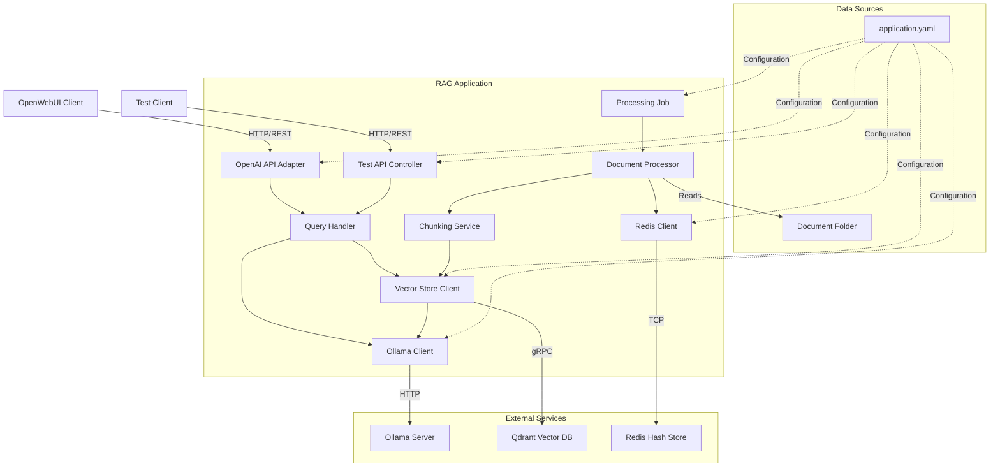
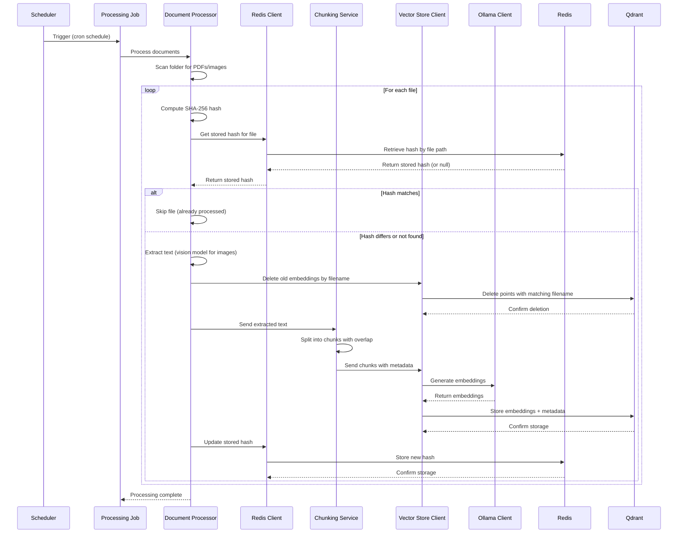
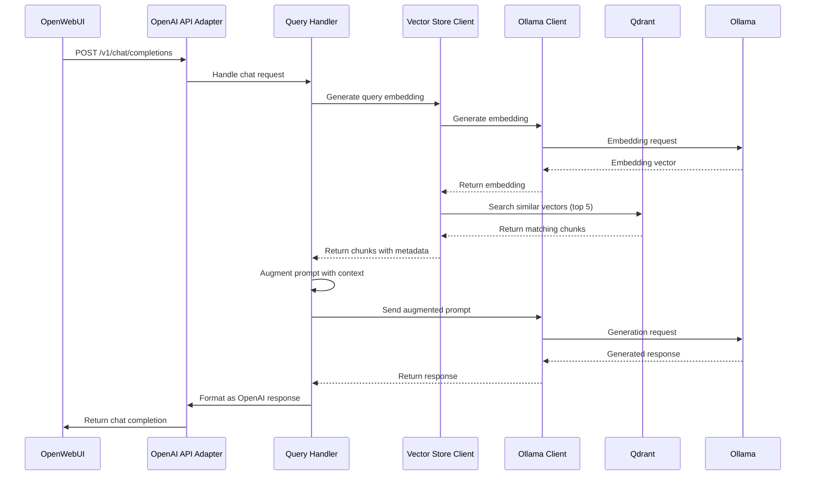

# Design Document: RAG OpenAI API with Ollama

## Overview

This design document specifies the architecture and implementation details for a Retrieval-Augmented Generation (RAG) application that exposes OpenAI-compatible API endpoints while leveraging local Ollama LLM models. The system processes documents (PDFs and images) from a configured folder, extracts text using Ollama vision-capable models for images and traditional parsing for PDFs, chunks it into fixed-size segments, generates vector embeddings, stores them in Qdrant, and augments user prompts with relevant context before generating responses.

The application follows functional programming principles using Java 25, Spring Boot 4, and Gradle 9.2. It emphasizes immutability, functional composition, and declarative programming patterns.

### Key Design Goals

- **API Compatibility**: Provide OpenAI-compatible endpoints for seamless integration with existing clients like OpenWebUI
- **Local Processing**: Use local Ollama models to avoid external API dependencies
- **Functional Design**: Leverage functional programming patterns for maintainability and testability
- **Scalability**: Support batch processing and asynchronous operations
- **Observability**: Comprehensive logging and health monitoring

## Architecture

### High-Level Architecture



### Component Interaction Flow

**Document Processing Flow:**


**Query Processing Flow:**


### Layered Architecture

The application follows a layered architecture pattern:

1. **API Layer**: REST controllers exposing OpenAI-compatible endpoints
2. **Service Layer**: Business logic for query handling, document processing, and orchestration
3. **Client Layer**: Integration with external services (Ollama, Qdrant)
4. **Domain Layer**: Immutable data models and DTOs
5. **Configuration Layer**: Application configuration and validation

## Components and Interfaces

### 1. OpenAI API Adapter

**Responsibility**: Expose OpenAI-compatible REST endpoints and handle HTTP request/response transformation.

**Interface**:
```java
@RestController
@RequestMapping("/v1")
public interface OpenAIApiController {
    
    @PostMapping("/chat/completions")
    CompletableFuture<ResponseEntity<?>> chatCompletions(
        @RequestBody ChatCompletionRequest request
    );
    
    @GetMapping("/models")
    CompletableFuture<ResponseEntity<ModelsResponse>> listModels();
}
```

**Key Responsibilities**:
- Validate incoming OpenAI-formatted requests
- Delegate to Query Handler for processing
- Transform responses to OpenAI format
- Handle both streaming and non-streaming responses
- Return OpenAI-compatible error responses

**Functional Patterns**:
- Use `CompletableFuture` for asynchronous request handling
- Validate requests using functional validation chains
- Transform responses using `map` and `flatMap` operations

### 1a. Simple Test API Controller

**Responsibility**: Provide a simplified plain-text endpoint for testing RAG functionality without OpenAI formatting overhead.

**Interface**:
```java
@RestController
@RequestMapping("/api/test")
@Tag(name = "Test API", description = "Simple testing endpoints for RAG functionality")
public interface TestApiController {
    
    @PostMapping(value = "/query", 
                 consumes = "text/plain", 
                 produces = "text/plain")
    @Operation(
        summary = "Simple RAG query endpoint",
        description = "Accepts a plain text prompt and returns a plain text response using the RAG pipeline"
    )
    @ApiResponses(value = {
        @ApiResponse(
            responseCode = "200",
            description = "Successful response with generated text",
            content = @Content(
                mediaType = "text/plain",
                schema = @Schema(type = "string"),
                examples = @ExampleObject(
                    value = "Based on the provided context, the answer is..."
                )
            )
        ),
        @ApiResponse(
            responseCode = "500",
            description = "Internal server error",
            content = @Content(
                mediaType = "text/plain",
                schema = @Schema(type = "string"),
                examples = @ExampleObject(
                    value = "Error processing request: service unavailable"
                )
            )
        )
    })
    CompletableFuture<ResponseEntity<String>> testQuery(
        @RequestBody 
        @io.swagger.v3.oas.annotations.parameters.RequestBody(
            description = "Plain text prompt for RAG query",
            required = true,
            content = @Content(
                mediaType = "text/plain",
                schema = @Schema(type = "string"),
                examples = @ExampleObject(
                    value = "What is the main topic of the documents?"
                )
            )
        )
        String prompt
    );
}
```

**Key Responsibilities**:
- Accept plain text prompts without JSON formatting
- Delegate to Query Handler using the same RAG pipeline
- Return plain text responses without OpenAI formatting
- Handle errors with plain text error messages
- Provide simple testing interface for developers
- Expose OpenAPI documentation for the endpoint

**Functional Patterns**:
- Use `CompletableFuture` for asynchronous request handling
- Extract response text from OpenAI format using `map` operations
- Handle errors using `exceptionally` with plain text messages

### 2. Query Handler

**Responsibility**: Orchestrate RAG operations including embedding generation, vector search, prompt augmentation, and response generation.

**Interface**:
```java
public interface QueryHandler {
    
    CompletableFuture<ChatCompletionResponse> handleQuery(
        ChatCompletionRequest request
    );
    
    CompletableFuture<Flux<ChatCompletionChunk>> handleStreamingQuery(
        ChatCompletionRequest request
    );
}
```

**Key Responsibilities**:
- Extract user prompt from request
- Generate query embedding via Vector Store Client
- Retrieve relevant chunks from Qdrant
- Construct augmented prompt with context
- Send augmented prompt to Ollama Client
- Format response according to OpenAI specification

**Functional Patterns**:
- Chain operations using `CompletableFuture.thenCompose`
- Use `Optional` for handling cases with no relevant chunks
- Compose prompt augmentation as pure functions
- Use reactive streams (`Flux`) for streaming responses

### 3. Ollama Client

**Responsibility**: Communicate with local Ollama server for text generation, embedding generation, and vision-based image analysis.

**Interface**:
```java
public interface OllamaClient {
    
    CompletableFuture<String> generate(
        String prompt,
        String modelName
    );
    
    CompletableFuture<Flux<String>> generateStreaming(
        String prompt,
        String modelName
    );
    
    CompletableFuture<List<Float>> generateEmbedding(
        String text,
        String embeddingModelName
    );
    
    CompletableFuture<String> analyzeImage(
        byte[] imageData,
        String prompt,
        String visionModelName
    );
    
    CompletableFuture<Boolean> verifyConnectivity();
}
```

**Key Responsibilities**:
- Establish HTTP connection to Ollama server
- Format requests according to Ollama API specification
- Parse Ollama responses
- Support both streaming and non-streaming modes
- Send images to vision-capable models for text extraction
- Handle connection errors with appropriate logging

**Functional Patterns**:
- Use `CompletableFuture` for all async operations
- Use `Flux` for streaming token responses
- Implement retry logic using functional composition
- Handle errors using `exceptionally` and `handle` methods
- Encode images as base64 for vision API requests

**Vision Model Integration**:

The Ollama Client uses vision-capable models (such as qwen3-vl:8b, llava, or similar) to extract text from images. This approach provides several advantages over traditional OCR:

- **Contextual Understanding**: Vision models can understand context, semantics, and visual layout beyond just text
- **Better Accuracy**: Modern vision models handle complex layouts, diagrams, and charts more effectively
- **Unified Infrastructure**: Uses the same Ollama server already in use for embeddings and generation
- **No Additional Dependencies**: Eliminates the need for Tesseract OCR and its language data files
- **Flexible Prompting**: Can customize extraction behavior through prompts (e.g., "Extract all text from this image")

**Image Processing Flow**:
1. Read image file as byte array
2. Encode image data as base64 string
3. Send to Ollama vision endpoint with prompt: "Extract all visible text from this image. Return only the text content without any additional commentary."
4. Receive extracted text from vision model
5. Pass extracted text to chunking service

**Supported Vision Models**:
- `qwen3-vl:8b` (default): Advanced vision model with strong OCR and layout understanding
- `llava`: Efficient vision-language model with good text extraction capabilities
- `bakllava`: Alternative vision model with different performance characteristics
- Any other Ollama-compatible vision model that supports image input

### 4. Vector Store Client

**Responsibility**: Interact with Qdrant vector database for storing and retrieving embeddings.

**Interface**:
```java
public interface VectorStoreClient {
    
    CompletableFuture<Void> ensureCollectionExists(
        String collectionName,
        int vectorDimension
    );
    
    CompletableFuture<Void> storeEmbeddings(
        List<EmbeddingRecord> records
    );
    
    CompletableFuture<List<ScoredChunk>> searchSimilar(
        List<Float> queryEmbedding,
        int topK
    );
    
    CompletableFuture<Void> deleteEmbeddingsByFilename(
        String filename
    );
    
    CompletableFuture<Boolean> verifyConnectivity();
}
```

**Key Responsibilities**:
- Connect to Qdrant using gRPC
- Create collection if it doesn't exist
- Store embeddings with associated metadata
- Perform vector similarity search
- Delete embeddings by filename metadata for modified files
- Handle batch operations efficiently

**Functional Patterns**:
- Use `CompletableFuture` for async operations
- Process batches using Stream API
- Implement exponential backoff using functional retry
- Use immutable `EmbeddingRecord` and `ScoredChunk` DTOs

### 5. Redis Client

**Responsibility**: Interact with Redis for storing and retrieving file hashes to track document processing state.

**Interface**:
```java
public interface RedisClient {
    
    CompletableFuture<Optional<String>> getFileHash(
        Path filePath
    );
    
    CompletableFuture<Void> storeFileHash(
        Path filePath,
        String hash
    );
    
    CompletableFuture<Map<Path, String>> getAllFileHashes();
    
    CompletableFuture<Void> deleteFileHash(
        Path filePath
    );
    
    CompletableFuture<Boolean> verifyConnectivity();
}
```

**Key Responsibilities**:
- Connect to Redis using configured host and port
- Store file hashes using file path as key
- Retrieve stored hashes for comparison
- Support bulk retrieval of all stored hashes
- Handle connection errors gracefully
- Provide connectivity verification for health checks

**Functional Patterns**:
- Use `CompletableFuture` for all async operations
- Use `Optional` for handling missing hash values
- Implement connection pooling for efficiency
- Handle errors using `exceptionally` and return empty results on failure
- Use immutable key-value pairs

### 6. Document Processor

**Responsibility**: Scan document folder, extract text from PDFs and images, compute file hashes for change detection, and coordinate processing pipeline.

**Interface**:
```java
public interface DocumentProcessor {
    
    CompletableFuture<ProcessingResult> processDocuments(
        Path inputFolder
    );
    
    CompletableFuture<Optional<String>> extractTextFromPdf(
        Path pdfFile
    );
    
    CompletableFuture<Optional<String>> extractTextFromImage(
        Path imageFile
    );
    
    CompletableFuture<String> computeFileHash(
        Path file
    );
    
    CompletableFuture<Boolean> shouldProcessFile(
        Path file,
        String currentHash
    );
}
```

**Key Responsibilities**:
- Scan configured folder for PDF and image files
- Compute SHA-256 hash for each file
- Check Redis for stored hashes to detect changes
- Extract text from PDFs using Apache PDFBox
- Extract text from images using Ollama vision-capable models (llava, qwen3-vl, etc.)
- Skip files with matching hashes (already processed)
- Coordinate deletion of old embeddings for modified files
- Handle file read errors gracefully

**Functional Patterns**:
- Use Stream API to process file lists
- Use `Optional` for handling extraction failures
- Compose extraction operations functionally
- Use `CompletableFuture.allOf` for parallel processing
- Use functional predicates for file filtering

### 6. Chunking Service

**Responsibility**: Split extracted text into fixed-size chunks with configurable overlap.

**Interface**:
```java
public interface ChunkingService {
    
    List<TextChunk> chunkText(
        String text,
        DocumentMetadata metadata,
        int chunkSize,
        int overlapSize
    );
}
```

**Key Responsibilities**:
- Split text into chunks of configured size
- Apply overlap between consecutive chunks
- Preserve word boundaries
- Attach metadata (filename, chunk index) to each chunk
- Handle edge cases (text shorter than chunk size)

**Functional Patterns**:
- Implement as pure function (no side effects)
- Use Stream API for chunk generation
- Use immutable `TextChunk` and `DocumentMetadata` records
- Compose chunking logic using functional operations

### 7. Processing Job

**Responsibility**: Execute scheduled document processing and provide on-demand processing trigger.

**Interface**:
```java
@Component
public interface ProcessingJob {
    
    @Scheduled(cron = "${processing.schedule}")
    void executeScheduledProcessing();
    
    @Operation(
        summary = "Trigger document processing",
        description = "Manually trigger document processing job to index new or modified documents"
    )
    @ApiResponses(value = {
        @ApiResponse(
            responseCode = "200",
            description = "Processing started successfully",
            content = @Content(
                mediaType = "application/json",
                schema = @Schema(implementation = ProcessingResult.class)
            )
        ),
        @ApiResponse(
            responseCode = "409",
            description = "Processing already in progress",
            content = @Content(
                mediaType = "application/json",
                schema = @Schema(implementation = ErrorResponse.class)
            )
        )
    })
    CompletableFuture<ProcessingResult> triggerProcessing();
    
    boolean isProcessingInProgress();
}
```

**Key Responsibilities**:
- Execute on configured cron schedule
- Coordinate document processing pipeline
- Track processing state to prevent concurrent execution
- Log processing metrics (start time, end time, document count)
- Provide on-demand trigger endpoint with OpenAPI documentation

**Functional Patterns**:
- Use `CompletableFuture` for async execution
- Use atomic state management for concurrency control
- Compose processing steps functionally
- Use Stream API for aggregating results

## Data Models

### Request/Response DTOs

```java
// OpenAI Chat Completion Request
public record ChatCompletionRequest(
    String model,
    List<Message> messages,
    boolean stream,
    Optional<Double> temperature,
    Optional<Integer> maxTokens
) {}

public record Message(
    String role,
    String content
) {}

// OpenAI Chat Completion Response (non-streaming)
public record ChatCompletionResponse(
    String id,
    String object,
    long created,
    String model,
    List<Choice> choices,
    Usage usage
) {}

public record Choice(
    int index,
    Message message,
    String finishReason
) {}

public record Usage(
    int promptTokens,
    int completionTokens,
    int totalTokens
) {}

// OpenAI Chat Completion Chunk (streaming)
public record ChatCompletionChunk(
    String id,
    String object,
    long created,
    String model,
    List<ChunkChoice> choices
) {}

public record ChunkChoice(
    int index,
    Delta delta,
    String finishReason
) {}

public record Delta(
    Optional<String> role,
    Optional<String> content
) {}

// Models Response
public record ModelsResponse(
    String object,
    List<ModelInfo> data
) {}

public record ModelInfo(
    String id,
    String object,
    long created,
    String ownedBy
) {}
```

### Domain Models

```java
// Document and Chunk Models
public record DocumentMetadata(
    String filename,
    Path filePath,
    long lastModified,
    String fileType
) {}

public record TextChunk(
    String text,
    DocumentMetadata metadata,
    int chunkIndex,
    int startPosition,
    int endPosition
) {}

// Embedding Models
public record EmbeddingRecord(
    String id,
    List<Float> embedding,
    TextChunk chunk
) {}

public record ScoredChunk(
    TextChunk chunk,
    float score
) {}

// Processing Results
public record ProcessingResult(
    int documentsProcessed,
    int documentsSkipped,
    int chunksCreated,
    int embeddingsStored,
    long processingTimeMs,
    List<String> errors
) {}

// File Hash Models
public record FileHashRecord(
    Path filePath,
    String hash,
    long lastProcessed
) {}

// Error Response Models
public record ErrorResponse(
    String message,
    String error,
    int status,
    long timestamp
) {}
```

### Ollama API Models

```java
// Ollama Generation Request
public record OllamaGenerateRequest(
    String model,
    String prompt,
    boolean stream,
    Optional<OllamaOptions> options
) {}

public record OllamaOptions(
    Optional<Double> temperature,
    Optional<Integer> numPredict
) {}

// Ollama Generation Response
public record OllamaGenerateResponse(
    String model,
    String response,
    boolean done
) {}

// Ollama Embedding Request
public record OllamaEmbeddingRequest(
    String model,
    String prompt
) {}

// Ollama Embedding Response
public record OllamaEmbeddingResponse(
    List<Float> embedding
) {}

// Ollama Vision Request
public record OllamaVisionRequest(
    String model,
    String prompt,
    List<String> images,
    boolean stream,
    Optional<OllamaOptions> options
) {}

// Ollama Vision Response
public record OllamaVisionResponse(
    String model,
    String response,
    boolean done
) {}
```

### Qdrant Models

```java
// Qdrant Point (vector with payload)
public record QdrantPoint(
    String id,
    List<Float> vector,
    Map<String, Object> payload
) {}

// Qdrant Search Request
public record QdrantSearchRequest(
    List<Float> vector,
    int limit,
    Optional<Map<String, Object>> filter
) {}

// Qdrant Search Result
public record QdrantSearchResult(
    String id,
    float score,
    Map<String, Object> payload
) {}
```

## Configuration Structure

### application.yaml

```yaml
server:
  port: 8080
  shutdown: graceful

spring:
  application:
    name: rag-openai-api-ollama
  lifecycle:
    timeout-per-shutdown-phase: 30s

# Ollama Configuration
ollama:
  host: 127.0.0.1
  port: 11434
  model-name: gpt-oss:20b
  embedding-model-name: qwen3-embedding:8b
  vision-model-name: qwen3-vl:8b
  connection-timeout: 30s
  read-timeout: 120s

# Qdrant Configuration
qdrant:
  host: localhost
  port: 6334
  collection-name: documents
  vector-dimension: 768
  connection-timeout: 10s

# Redis Configuration
redis:
  host: localhost
  port: 6379
  connection-timeout: 5s
  database: 0

# Document Processing Configuration
documents:
  input-folder: ./documents
  supported-extensions:
    - pdf
    - jpg
    - jpeg
    - png
    - tiff

# Processing Job Configuration
processing:
  schedule: "0 */15 * * * *"  # Every 15 minutes
  chunk-size: 512
  chunk-overlap: 50
  batch-size: 100
  max-concurrent-files: 5
  job-timeout: 60s

# RAG Configuration
rag:
  top-k-results: 5
  similarity-threshold: 0.7
  context-separator: "\n\n---\n\n"
  prompt-template: |
    Use the following context to answer the question. If the context doesn't contain relevant information, say so.
    
    Context:
    {context}
    
    Question: {question}

# Logging Configuration
logging:
  level:
    root: INFO
    com.rag.openai: DEBUG
    io.qdrant: WARN
  pattern:
    console: "%d{yyyy-MM-dd HH:mm:ss} - %msg%n"
  file:
    name: logs/rag-application.log
    max-size: 10MB
    max-history: 30

# Actuator Configuration
management:
  endpoints:
    web:
      exposure:
        include: health,info,metrics
  endpoint:
    health:
      show-details: always
  health:
    defaults:
      enabled: true

# OpenAPI Configuration
springdoc:
  api-docs:
    path: /api-docs
    enabled: true
  swagger-ui:
    path: /swagger-ui.html
    enabled: true
    operationsSorter: method
    tagsSorter: alpha
  info:
    title: RAG OpenAI API with Ollama
    description: Retrieval-Augmented Generation API with OpenAI-compatible endpoints
    version: 1.0.0
    contact:
      name: API Support
      email: support@example.com
  show-actuator: false
```

### Configuration Classes

```java
@ConfigurationProperties(prefix = "ollama")
public record OllamaConfig(
    String host,
    int port,
    String modelName,
    String embeddingModelName,
    String visionModelName,
    Duration connectionTimeout,
    Duration readTimeout
) {
    public OllamaConfig {
        Objects.requireNonNull(host, "Ollama host must not be null");
        Objects.requireNonNull(modelName, "Ollama model name must not be null");
        Objects.requireNonNull(embeddingModelName, "Ollama embedding model name must not be null");
        Objects.requireNonNull(visionModelName, "Ollama vision model name must not be null");
        if (port <= 0 || port > 65535) {
            throw new IllegalArgumentException("Invalid port: " + port);
        }
    }
}

@ConfigurationProperties(prefix = "qdrant")
public record QdrantConfig(
    String host,
    int port,
    String collectionName,
    int vectorDimension,
    Duration connectionTimeout
) {
    public QdrantConfig {
        Objects.requireNonNull(host, "Qdrant host must not be null");
        Objects.requireNonNull(collectionName, "Collection name must not be null");
        if (port <= 0 || port > 65535) {
            throw new IllegalArgumentException("Invalid port: " + port);
        }
        if (vectorDimension <= 0) {
            throw new IllegalArgumentException("Vector dimension must be positive");
        }
    }
}

@ConfigurationProperties(prefix = "redis")
public record RedisConfig(
    String host,
    int port,
    Duration connectionTimeout,
    int database
) {
    public RedisConfig {
        Objects.requireNonNull(host, "Redis host must not be null");
        if (port <= 0 || port > 65535) {
            throw new IllegalArgumentException("Invalid port: " + port);
        }
        if (database < 0) {
            throw new IllegalArgumentException("Database index must be non-negative");
        }
    }
}

@ConfigurationProperties(prefix = "documents")
public record DocumentsConfig(
    Path inputFolder,
    List<String> supportedExtensions
) {
    public DocumentsConfig {
        Objects.requireNonNull(inputFolder, "Input folder must not be null");
        Objects.requireNonNull(supportedExtensions, "Supported extensions must not be null");
    }
}

@ConfigurationProperties(prefix = "processing")
public record ProcessingConfig(
    String schedule,
    int chunkSize,
    int chunkOverlap,
    int batchSize,
    int maxConcurrentFiles,
    Duration jobTimeout
) {
    public ProcessingConfig {
        Objects.requireNonNull(schedule, "Schedule must not be null");
        if (chunkSize <= 0) {
            throw new IllegalArgumentException("Chunk size must be positive");
        }
        if (chunkOverlap < 0 || chunkOverlap >= chunkSize) {
            throw new IllegalArgumentException("Invalid chunk overlap");
        }
    }
}

@ConfigurationProperties(prefix = "rag")
public record RagConfig(
    int topKResults,
    double similarityThreshold,
    String contextSeparator,
    String promptTemplate
) {
    public RagConfig {
        if (topKResults <= 0) {
            throw new IllegalArgumentException("Top K results must be positive");
        }
        if (similarityThreshold < 0.0 || similarityThreshold > 1.0) {
            throw new IllegalArgumentException("Similarity threshold must be between 0 and 1");
        }
        Objects.requireNonNull(contextSeparator, "Context separator must not be null");
        Objects.requireNonNull(promptTemplate, "Prompt template must not be null");
    }
}
```

### OpenAPI Configuration

The application uses SpringDoc OpenAPI to automatically generate API documentation from code annotations:

```java
@Configuration
public class OpenAPIConfiguration {
    
    @Bean
    public OpenAPI customOpenAPI() {
        return new OpenAPI()
            .info(new Info()
                .title("RAG OpenAI API with Ollama")
                .version("1.0.0")
                .description("Retrieval-Augmented Generation API with OpenAI-compatible endpoints")
                .contact(new Contact()
                    .name("API Support")
                    .email("support@example.com")))
            .servers(List.of(
                new Server()
                    .url("http://localhost:8080")
                    .description("Local development server")))
            .externalDocs(new ExternalDocumentation()
                .description("Project Documentation")
                .url("https://github.com/example/rag-openai-api-ollama"));
    }
    
    @Bean
    public GroupedOpenApi publicApi() {
        return GroupedOpenApi.builder()
            .group("public")
            .pathsToMatch("/v1/**", "/api/**")
            .pathsToExclude("/actuator/**")
            .build();
    }
}
```

**Key Features**:
- Automatic OpenAPI 3.0 specification generation from annotations
- Swagger UI for interactive API testing
- Support for request/response examples
- Schema documentation for all DTOs
- Endpoint grouping and filtering
```

## Technology Stack

### Core Technologies

- **Java 25**: Latest LTS version with enhanced pattern matching, virtual threads, and performance improvements
- **Spring Boot 4**: Modern Spring framework with improved observability and native compilation support
- **Gradle 9.2**: Build automation with improved dependency management and build cache

### Key Dependencies

```gradle
dependencies {
    // Spring Boot
    implementation 'org.springframework.boot:spring-boot-starter-web'
    implementation 'org.springframework.boot:spring-boot-starter-actuator'
    implementation 'org.springframework.boot:spring-boot-starter-validation'
    
    // Reactive Support
    implementation 'org.springframework.boot:spring-boot-starter-webflux'
    implementation 'io.projectreactor:reactor-core'
    
    // HTTP Client
    implementation 'org.springframework.boot:spring-boot-starter-webclient'
    
    // OpenAPI and Swagger
    implementation 'org.springdoc:springdoc-openapi-starter-webmvc-ui:2.3.0'
    
    // PDF Processing
    implementation 'org.apache.pdfbox:pdfbox:3.0.1'
    
    // Qdrant Client
    implementation 'io.qdrant:client:1.7.0'
    
    // Redis Client
    implementation 'org.springframework.boot:spring-boot-starter-data-redis'
    implementation 'io.lettuce:lettuce-core'
    
    // JSON Processing
    implementation 'com.fasterxml.jackson.core:jackson-databind'
    implementation 'com.fasterxml.jackson.datatype:jackson-datatype-jdk8'
    
    // Logging
    implementation 'org.slf4j:slf4j-api'
    implementation 'ch.qos.logback:logback-classic'
    
    // Testing
    testImplementation 'org.springframework.boot:spring-boot-starter-test'
    testImplementation 'io.projectreactor:reactor-test'
    testImplementation 'org.junit.jupiter:junit-jupiter'
    testImplementation 'org.mockito:mockito-core'
    testImplementation 'org.mockito:mockito-junit-jupiter'
    testImplementation 'org.assertj:assertj-core'
    testImplementation 'net.jqwik:jqwik:1.8.2'
}
```

### Build Configuration

```gradle
plugins {
    id 'java'
    id 'org.springframework.boot' version '4.0.0'
    id 'io.spring.dependency-management' version '1.1.4'
}

group = 'com.rag'
version = '1.0.0'

java {
    toolchain {
        languageVersion = JavaLanguageVersion.of(25)
    }
}

repositories {
    mavenCentral()
}

tasks.named('test') {
    useJUnitPlatform()
}
```

### Gradle Wrapper Configuration

The application uses Gradle Wrapper to ensure consistent builds across environments without requiring a global Gradle installation.

**Wrapper Files**:
- `gradlew` - Unix/Linux/macOS wrapper script
- `gradlew.bat` - Windows wrapper script
- `gradle/wrapper/gradle-wrapper.jar` - Wrapper executable JAR
- `gradle/wrapper/gradle-wrapper.properties` - Wrapper configuration

**gradle-wrapper.properties**:
```properties
distributionBase=GRADLE_USER_HOME
distributionPath=wrapper/dists
distributionUrl=https\://services.gradle.org/distributions/gradle-9.2-bin.zip
networkTimeout=10000
validateDistributionUrl=true
zipStoreBase=GRADLE_USER_HOME
zipStorePath=wrapper/dists
```

**Usage**:
```bash
# Build the application
./gradlew build

# Run tests
./gradlew test

# Run the application
./gradlew bootRun

# Clean build artifacts
./gradlew clean
```

**Benefits**:
- Consistent Gradle version across all environments
- No need for global Gradle installation
- Automatic download of specified Gradle version
- Version-controlled wrapper ensures reproducible builds

## Docker Deployment Configuration

### Dockerfile

```dockerfile
FROM eclipse-temurin:25-jdk-alpine AS builder

WORKDIR /app

# Copy Gradle wrapper and build files
COPY gradlew .
COPY gradlew.bat .
COPY gradle gradle
COPY build.gradle .
COPY settings.gradle .

# Make gradlew executable
RUN chmod +x gradlew

# Copy source code
COPY src src

# Build the application using Gradle wrapper
RUN ./gradlew build -x test --no-daemon

FROM eclipse-temurin:25-jre-alpine

WORKDIR /app

# Copy the built JAR from builder stage
COPY --from=builder /app/build/libs/*.jar app.jar

# Create documents directory
RUN mkdir -p /app/documents

# Expose application port
EXPOSE 8080

# Health check
HEALTHCHECK --interval=30s --timeout=10s --start-period=60s --retries=3 \
  CMD wget --no-verbose --tries=1 --spider http://localhost:8080/actuator/health || exit 1

# Run the application
ENTRYPOINT ["java", "-jar", "app.jar"]
```

### docker-compose.yml

```yaml
version: '3.8'

services:
  qdrant:
    image: qdrant/qdrant:v1.7.4
    container_name: rag-qdrant
    ports:
      - "6333:6333"
      - "6334:6334"
    volumes:
      - qdrant_storage:/qdrant/storage
    environment:
      - QDRANT__SERVICE__GRPC_PORT=6334
    healthcheck:
      test: ["CMD", "wget", "--no-verbose", "--tries=1", "--spider", "http://localhost:6333/health"]
      interval: 10s
      timeout: 5s
      retries: 5
    networks:
      - rag-network

  redis:
    image: redis:7-alpine
    container_name: rag-redis
    ports:
      - "6379:6379"
    volumes:
      - redis_data:/data
    command: redis-server --appendonly yes
    healthcheck:
      test: ["CMD", "redis-cli", "ping"]
      interval: 10s
      timeout: 5s
      retries: 5
    networks:
      - rag-network

  rag-app:
    build:
      context: .
      dockerfile: Dockerfile
    container_name: rag-application
    ports:
      - "8080:8080"
    volumes:
      - ./documents:/app/documents:ro
    environment:
      - SPRING_PROFILES_ACTIVE=docker
      - OLLAMA_HOST=host.docker.internal
      - OLLAMA_PORT=11434
      - QDRANT_HOST=qdrant
      - QDRANT_PORT=6334
      - REDIS_HOST=redis
      - REDIS_PORT=6379
      - DOCUMENTS_INPUT_FOLDER=/app/documents
    depends_on:
      qdrant:
        condition: service_healthy
      redis:
        condition: service_healthy
    healthcheck:
      test: ["CMD", "wget", "--no-verbose", "--tries=1", "--spider", "http://localhost:8080/actuator/health"]
      interval: 30s
      timeout: 10s
      start_period: 60s
      retries: 3
    networks:
      - rag-network
    extra_hosts:
      - "host.docker.internal:host-gateway"

volumes:
  qdrant_storage:
    driver: local
  redis_data:
    driver: local

networks:
  rag-network:
    driver: bridge
```

### Docker Deployment Notes

**Environment Variable Overrides**:
- All configuration properties support environment variable overrides
- Use uppercase with underscores (e.g., `OLLAMA_HOST` for `ollama.host`)
- Spring Boot automatically maps environment variables to configuration properties

**Ollama Access**:
- Ollama runs on the host machine (not containerized)
- Use `host.docker.internal` to access host services from containers
- The `extra_hosts` configuration enables this mapping

**Volume Mounts**:
- Documents folder is mounted read-only from host to container
- Qdrant and Redis data are persisted in Docker volumes
- Logs can be accessed via `docker logs rag-application`

**Health Checks**:
- All services include health checks for proper startup ordering
- Application waits for Qdrant and Redis to be healthy before starting
- Health check endpoints verify connectivity to all external services

**Deployment Commands**:
```bash
# Build and start all services
docker-compose up -d

# View logs
docker-compose logs -f rag-app

# Stop all services
docker-compose down

# Stop and remove volumes (clean slate)
docker-compose down -v

# Rebuild application after code changes
docker-compose up -d --build rag-app
```

## Functional Programming Patterns

### 1. Immutability

All data models use Java records for immutability:

```java
public record TextChunk(
    String text,
    DocumentMetadata metadata,
    int chunkIndex
) {
    // Immutable by default, no setters
}
```

### 2. Pure Functions

Service methods are designed as pure functions where possible:

```java
public List<TextChunk> chunkText(String text, int chunkSize, int overlap) {
    // Pure function: same input always produces same output
    // No side effects, no mutable state
    return IntStream.range(0, calculateChunkCount(text, chunkSize, overlap))
        .mapToObj(i -> createChunk(text, i, chunkSize, overlap))
        .toList();
}
```

### 3. Functional Composition

Chain operations using functional interfaces:

```java
public CompletableFuture<ChatCompletionResponse> handleQuery(ChatCompletionRequest request) {
    return extractPrompt(request)
        .thenCompose(this::generateQueryEmbedding)
        .thenCompose(this::searchSimilarChunks)
        .thenApply(chunks -> augmentPrompt(request, chunks))
        .thenCompose(this::generateResponse)
        .thenApply(this::formatResponse);
}
```

### 4. Stream API Usage

Process collections declaratively:

```java
public CompletableFuture<ProcessingResult> processDocuments(Path folder) {
    return CompletableFuture.supplyAsync(() -> {
        try (var files = Files.list(folder)) {
            return files
                .filter(this::isSupportedFile)
                .map(this::processFile)
                .collect(Collectors.toList());
        }
    });
}
```

### 5. Optional for Null Safety

Use Optional instead of null checks:

```java
public Optional<String> extractTextFromPdf(Path file) {
    try {
        return Optional.of(performExtraction(file));
    } catch (IOException e) {
        logger.error("Failed to extract text from {}", file, e);
        return Optional.empty();
    }
}
```

### 6. CompletableFuture for Async Operations

All external service calls return CompletableFuture:

```java
public CompletableFuture<List<Float>> generateEmbedding(String text) {
    return CompletableFuture.supplyAsync(() -> {
        var request = new OllamaEmbeddingRequest(embeddingModel, text);
        return webClient.post()
            .uri("/api/embeddings")
            .bodyValue(request)
            .retrieve()
            .bodyToMono(OllamaEmbeddingResponse.class)
            .map(OllamaEmbeddingResponse::embedding)
            .toFuture()
            .join();
    });
}
```

### 7. Method References

Use method references for cleaner code:

```java
public List<TextChunk> processAllDocuments(List<Path> files) {
    return files.stream()
        .map(this::extractText)
        .flatMap(Optional::stream)
        .map(this::chunkText)
        .flatMap(List::stream)
        .toList();
}
```


## Correctness Properties

*A property is a characteristic or behavior that should hold true across all valid executions of a system—essentially, a formal statement about what the system should do. Properties serve as the bridge between human-readable specifications and machine-verifiable correctness guarantees.*

### Property Reflection

After analyzing all acceptance criteria, I identified the following redundancies and consolidations:

- **Request validation properties (1.2, 1.6)**: Combined into a single property about validation behavior
- **Streaming properties (1.4, 1.5, 2.7, 11.1, 11.3, 11.4)**: Consolidated into properties about streaming vs non-streaming behavior
- **Configuration properties (2.2, 2.3, 3.1-3.7, 15.1, 15.2)**: These are example tests, not properties
- **Chunking properties (6.1, 6.2, 6.3, 6.4)**: Combined into comprehensive chunking properties
- **Document scanning properties (4.1, 5.1)**: Combined into a single property about file discovery
- **Ollama format properties (2.5, 2.6)**: Combined into round-trip property
- **Response format properties (1.3, 10.7, 11.4)**: Consolidated into properties about format compliance

### Property 1: Request Validation

*For any* chat completion request, if the request structure is invalid (missing required fields, invalid types, or malformed data), then the API adapter should return an error response in OpenAI error format with appropriate HTTP status code.

**Validates: Requirements 1.2, 1.6**

### Property 2: Response Format Compliance

*For any* valid chat completion request with stream=false, the response should conform to the OpenAI chat completion response format including all required fields (id, object, created, model, choices, usage).

**Validates: Requirements 1.3, 10.7**

### Property 3: Streaming Response Format Compliance

*For any* valid chat completion request with stream=true, each streaming chunk should conform to the OpenAI streaming format with required fields (id, object, created, model, choices with delta).

**Validates: Requirements 1.4, 11.4**

### Property 4: Streaming Mode Selection

*For any* chat completion request, if stream=true then the response should be delivered as server-sent events, and if stream=false then the response should be delivered as a single JSON object.

**Validates: Requirements 1.4, 1.5, 11.1**

### Property 5: Ollama Request Format Round Trip

*For any* prompt text, when formatted as an Ollama request and then parsed back, the prompt content should be preserved exactly.

**Validates: Requirements 2.5, 2.6**

### Property 6: Configuration Validation

*For any* application configuration, if any required property (ollama.host, ollama.port, ollama.model-name, ollama.embedding-model-name, qdrant.host, qdrant.port, qdrant.collection-name, documents.input-folder, processing.chunk-size) is missing or invalid, then the application should fail to start with a descriptive error message.

**Validates: Requirements 3.8, 15.5**

### Property 7: Document Discovery

*For any* folder containing files, the document processor should discover all files with supported extensions (pdf, jpg, jpeg, png, tiff) and ignore files with unsupported extensions.

**Validates: Requirements 4.1, 5.1**

### Property 8: PDF Text Extraction

*For any* valid PDF file, the document processor should extract text content that, when non-empty, can be passed to the chunking service.

**Validates: Requirements 4.2**

### Property 9: Image Text Extraction

*For any* valid image file with supported extension, the document processor should use Ollama vision model to analyze the image and extract text content that can be passed to the chunking service.

**Validates: Requirements 5.2**

### Property 10: Chunk Size Compliance

*For any* text longer than the configured chunk size, all chunks except possibly the last should have length equal to the configured chunk size (respecting word boundaries).

**Validates: Requirements 6.1**

### Property 11: Chunk Overlap Compliance

*For any* text that produces multiple chunks, consecutive chunks should overlap by approximately the configured overlap size (respecting word boundaries).

**Validates: Requirements 6.2**

### Property 12: Word Boundary Preservation

*For any* text that is chunked, no chunk should split a word in the middle (chunks should end at whitespace or punctuation).

**Validates: Requirements 6.3**

### Property 13: Chunk Metadata Completeness

*For any* chunk produced by the chunking service, the chunk should include metadata with source filename, chunk index, start position, and end position.

**Validates: Requirements 6.4**

### Property 14: Embedding Generation

*For any* text chunk, the vector store client should generate an embedding vector with dimension matching the configured vector dimension.

**Validates: Requirements 7.4**

### Property 15: Embedding Storage Round Trip

*For any* embedding record with metadata, after storing in Qdrant and retrieving by ID, the retrieved record should contain the same embedding vector and metadata (within floating-point precision).

**Validates: Requirements 7.5**

### Property 16: Batch Insertion Equivalence

*For any* list of embedding records, storing them as a batch should produce the same result as storing them individually (all records should be retrievable with correct data).

**Validates: Requirements 7.6**

### Property 17: Incremental Processing

*For any* folder state, if the processing job runs twice without any file modifications between runs, the second run should process zero documents.

**Validates: Requirements 8.3, 8.4**

### Property 18: Modified File Detection

*For any* folder state, if a file is modified after being processed, the next processing job execution should reprocess that file.

**Validates: Requirements 8.4**

### Property 19: Complete Folder Processing

*For any* folder containing documents, when the processing job executes, it should process all new and modified documents in the folder.

**Validates: Requirements 8.2**

### Property 20: Prompt Extraction

*For any* valid chat completion request with messages, the query handler should extract the content of the last user message as the prompt.

**Validates: Requirements 10.1**

### Property 21: Query Embedding Generation

*For any* user prompt, the query handler should generate an embedding vector with dimension matching the configured vector dimension.

**Validates: Requirements 10.2**

### Property 22: Top-K Retrieval

*For any* query embedding, the query handler should retrieve exactly K chunks (or fewer if fewer than K chunks exist in the database) ordered by similarity score descending.

**Validates: Requirements 10.3**

### Property 23: Prompt Augmentation Structure

*For any* user prompt and retrieved chunks, the augmented prompt should contain the context section followed by the separator followed by the user question, with all retrieved chunk texts included in the context section.

**Validates: Requirements 10.4, 10.5**

### Property 24: Streaming Token Forwarding

*For any* streaming response from Ollama, all tokens should be forwarded to the client in the order they are received, with each token formatted as an OpenAI streaming chunk.

**Validates: Requirements 11.3**

### Property 25: Concurrent Processing Prevention

*For any* state where processing is already running, if the trigger endpoint is called, it should return HTTP 409 Conflict status without starting a new processing job.

**Validates: Requirements 9.5**

### Property 26: Plain Text Request Handling

*For any* plain text string sent to the test endpoint, the endpoint should accept it with Content-Type text/plain and pass it to the Query Handler for processing.

**Validates: Requirements 25.2, 25.6**

### Property 27: RAG Pipeline Equivalence

*For any* prompt, when processed through the test endpoint versus the OpenAI endpoint, both should use the same RAG pipeline (embedding generation, vector search, prompt augmentation, response generation).

**Validates: Requirements 25.3, 25.4**

### Property 28: Plain Text Response Format

*For any* successful response from the test endpoint, the response should be plain text without JSON formatting and use Content-Type text/plain.

**Validates: Requirements 25.5, 25.6**

### Property 29: Plain Text Error Handling

*For any* error condition during test endpoint processing, the response should be a plain text error message with appropriate HTTP status code (not JSON formatted).

**Validates: Requirements 25.7**

### Property 30: OpenAPI Documentation Completeness

*For any* public API endpoint, the OpenAPI specification should include descriptions, request/response schemas, and example payloads.

**Validates: Requirements 26.4, 26.7**


## Error Handling

### Error Handling Strategy

The application follows a layered error handling approach with specific strategies for different types of failures:

### 1. External Service Failures

**Ollama Connectivity Errors**:
```java
public CompletableFuture<String> generate(String prompt, String modelName) {
    return CompletableFuture.supplyAsync(() -> {
        try {
            return callOllamaApi(prompt, modelName);
        } catch (ConnectException e) {
            logger.error("Ollama server unreachable at {}:{}", host, port, e);
            throw new ServiceUnavailableException("Ollama service is unavailable", e);
        } catch (SocketTimeoutException e) {
            logger.error("Ollama request timeout for model {}", modelName, e);
            throw new ServiceTimeoutException("Ollama request timed out", e);
        }
    });
}
```

**Qdrant Connectivity Errors**:
```java
public CompletableFuture<Void> storeEmbeddings(List<EmbeddingRecord> records) {
    return retryWithBackoff(() -> {
        try {
            return qdrantClient.upsert(collectionName, toQdrantPoints(records));
        } catch (StatusRuntimeException e) {
            if (e.getStatus().getCode() == Status.Code.UNAVAILABLE) {
                logger.error("Qdrant unavailable at {}:{}", host, port, e);
                throw new ServiceUnavailableException("Qdrant service is unavailable", e);
            }
            throw e;
        }
    }, 3, Duration.ofSeconds(1));
}
```

**Retry Strategy**:
- Exponential backoff for transient failures
- Maximum 3 retry attempts
- Initial delay: 1 second, multiplier: 2
- Only retry on specific error codes (UNAVAILABLE, DEADLINE_EXCEEDED)

### 2. Document Processing Errors

**File Read Errors**:
```java
public CompletableFuture<Optional<String>> extractTextFromImage(Path file) {
    return CompletableFuture.supplyAsync(() -> {
        try {
            byte[] imageData = Files.readAllBytes(file);
            String extractedText = ollamaClient.analyzeImage(
                imageData,
                "Extract all visible text from this image. Return only the text content without any additional commentary.",
                visionModelName
            ).join();
            return Optional.of(extractedText);
        } catch (IOException e) {
            logger.error("Failed to read image file: {}", file, e);
            return Optional.empty();
        } catch (Exception e) {
            logger.error("Unexpected error processing image with vision model: {}", file, e);
            return Optional.empty();
        }
    });
}
```

**Strategy**:
- Log error with file path and exception details
- Return `Optional.empty()` for failed extractions
- Continue processing remaining files
- Include failed files in processing result summary

### 3. Validation Errors

**Request Validation**:
```java
public record ChatCompletionRequest(
    String model,
    List<Message> messages,
    boolean stream
) {
    public ChatCompletionRequest {
        Objects.requireNonNull(model, "Model must not be null");
        Objects.requireNonNull(messages, "Messages must not be null");
        if (messages.isEmpty()) {
            throw new IllegalArgumentException("Messages must not be empty");
        }
    }
    
    public void validate() {
        if (messages.stream().noneMatch(m -> "user".equals(m.role()))) {
            throw new ValidationException("Request must contain at least one user message");
        }
    }
}
```

**Configuration Validation**:
```java
@ConfigurationProperties(prefix = "processing")
public record ProcessingConfig(
    int chunkSize,
    int chunkOverlap
) {
    public ProcessingConfig {
        if (chunkSize <= 0) {
            throw new IllegalArgumentException("Chunk size must be positive");
        }
        if (chunkOverlap < 0 || chunkOverlap >= chunkSize) {
            throw new IllegalArgumentException(
                "Chunk overlap must be non-negative and less than chunk size"
            );
        }
    }
}
```

**Strategy**:
- Validate at construction time using compact constructor
- Throw descriptive exceptions with clear messages
- Fail fast for configuration errors (fail to start)
- Return 400 Bad Request for API validation errors

### 4. API Error Responses

**OpenAI Error Format**:
```java
public record OpenAIError(
    ErrorDetail error
) {}

public record ErrorDetail(
    String message,
    String type,
    String param,
    String code
) {}
```

**Error Mapping**:
```java
@ExceptionHandler(ValidationException.class)
public ResponseEntity<OpenAIError> handleValidation(ValidationException e) {
    return ResponseEntity
        .status(HttpStatus.BAD_REQUEST)
        .body(new OpenAIError(new ErrorDetail(
            e.getMessage(),
            "invalid_request_error",
            null,
            "invalid_request"
        )));
}

@ExceptionHandler(ServiceUnavailableException.class)
public ResponseEntity<OpenAIError> handleServiceUnavailable(ServiceUnavailableException e) {
    return ResponseEntity
        .status(HttpStatus.SERVICE_UNAVAILABLE)
        .body(new OpenAIError(new ErrorDetail(
            e.getMessage(),
            "service_unavailable",
            null,
            "service_unavailable"
        )));
}
```

### 5. Streaming Error Handling

**Streaming Errors**:
```java
public Flux<ChatCompletionChunk> handleStreamingQuery(ChatCompletionRequest request) {
    return Flux.defer(() -> {
        return performRAGQuery(request)
            .flatMapMany(ollamaClient::generateStreaming)
            .map(this::toOpenAIChunk)
            .onErrorResume(e -> {
                logger.error("Streaming error", e);
                return Flux.just(createErrorChunk(e.getMessage()));
            });
    });
}
```

**Strategy**:
- Catch errors in stream pipeline
- Send error event to client
- Close stream gracefully
- Log full error details server-side

### 6. Graceful Degradation

**No Results Found**:
```java
public CompletableFuture<ChatCompletionResponse> handleQuery(ChatCompletionRequest request) {
    return extractPrompt(request)
        .thenCompose(this::searchRelevantChunks)
        .thenCompose(chunks -> {
            if (chunks.isEmpty()) {
                logger.info("No relevant chunks found, using original prompt");
                return generateResponse(request.messages());
            }
            return generateResponse(augmentPrompt(request.messages(), chunks));
        });
}
```

**Strategy**:
- Proceed with original prompt if no chunks found
- Log degraded operation mode
- Return successful response (not an error)

### 7. Logging Standards

**Log Levels**:
- **ERROR**: Service unavailable, file processing failures, unexpected exceptions
- **WARN**: Retry attempts, degraded operations, configuration warnings
- **INFO**: Request received, processing started/completed, health checks
- **DEBUG**: Detailed request/response data, chunk details, embedding dimensions

**Structured Logging**:
```java
logger.error(
    "Failed to process document: file={}, error={}, duration={}ms",
    file.getFileName(),
    e.getClass().getSimpleName(),
    duration,
    e
);
```

## Testing Strategy

### Testing Approach

The application uses a dual testing approach combining traditional unit/integration tests with property-based tests:

1. **Unit Tests**: Verify specific examples, edge cases, and error conditions
2. **Property-Based Tests**: Verify universal properties across randomized inputs

### Test Structure Convention

All tests follow the Given-When-Then structure with `@DisplayName` annotations:

```java
@Test
@DisplayName("When valid chat request is received Then response conforms to OpenAI format")
void testChatCompletionResponseFormat() {
    // Given
    var request = new ChatCompletionRequest(
        "llama3.2",
        List.of(new Message("user", "Hello")),
        false
    );
    
    // When
    var response = queryHandler.handleQuery(request).join();
    
    // Then
    assertThat(response.object()).isEqualTo("chat.completion");
    assertThat(response.model()).isEqualTo("llama3.2");
    assertThat(response.choices()).isNotEmpty();
}
```

### Property-Based Testing Configuration

**Framework**: Use `jqwik` for property-based testing in Java

**Configuration**:
```java
@Property(tries = 100)
@DisplayName("Property 10: Chunk Size Compliance")
void chunkSizeCompliance(@ForAll @StringLength(min = 1000, max = 10000) String text) {
    // Feature: rag-openai-api-ollama, Property 10: For any text longer than the configured chunk size, all chunks except possibly the last should have length equal to the configured chunk size
    
    // Given
    int chunkSize = 512;
    int overlap = 50;
    
    // When
    var chunks = chunkingService.chunkText(text, metadata, chunkSize, overlap);
    
    // Then
    for (int i = 0; i < chunks.size() - 1; i++) {
        assertThat(chunks.get(i).text().length())
            .isGreaterThanOrEqualTo(chunkSize - 50) // Allow for word boundaries
            .isLessThanOrEqualTo(chunkSize + 50);
    }
}

@Property(tries = 100)
@DisplayName("Property 26: Plain Text Request Handling")
void plainTextRequestHandling(@ForAll("plainTextPrompts") String prompt) {
    // Feature: rag-openai-api-ollama, Property 26: For any plain text string sent to the test endpoint, the endpoint should accept it with Content-Type text/plain
    
    // Given
    var request = MockMvcRequestBuilders
        .post("/api/test/query")
        .contentType(MediaType.TEXT_PLAIN)
        .content(prompt);
    
    // When
    var result = mockMvc.perform(request);
    
    // Then
    result.andExpect(status().isOk())
          .andExpect(content().contentType(MediaType.TEXT_PLAIN));
}

@Property(tries = 100)
@DisplayName("Property 28: Plain Text Response Format")
void plainTextResponseFormat(@ForAll("plainTextPrompts") String prompt) {
    // Feature: rag-openai-api-ollama, Property 28: For any successful response from the test endpoint, the response should be plain text without JSON formatting
    
    // Given
    var request = new TestQueryRequest(prompt);
    
    // When
    var response = testApiController.testQuery(prompt).join();
    
    // Then
    assertThat(response.getStatusCode()).isEqualTo(HttpStatus.OK);
    assertThat(response.getHeaders().getContentType()).isEqualTo(MediaType.TEXT_PLAIN);
    var body = response.getBody();
    assertThat(body).isNotNull();
    // Verify it's not JSON by checking it doesn't start with { or [
    assertThat(body).doesNotStartWith("{").doesNotStartWith("[");
}
```

**Property Test Requirements**:
- Minimum 100 iterations per property test
- Each test tagged with feature name and property number
- Use appropriate generators for domain types
- Test both happy path and edge cases

### Unit Test Coverage

**Component Tests**:

1. **OpenAI API Adapter**:
   - Valid request handling (example)
   - Invalid request validation (examples of various invalid formats)
   - Streaming vs non-streaming mode selection (examples)
   - Error response formatting (examples)
   - Models endpoint (example)

2. **Test API Controller**:
   - Plain text request acceptance (example)
   - Plain text response format (example)
   - Error handling with plain text (example)
   - Content-Type header validation (example)
   - RAG pipeline integration (example)

3. **Query Handler**:
   - Prompt extraction from messages (examples)
   - Prompt augmentation with context (examples)
   - No results found handling (edge case)
   - Response formatting (examples)

4. **Ollama Client**:
   - Request formatting (examples)
   - Response parsing (examples)
   - Vision model image analysis (examples)
   - Base64 image encoding (examples)
   - Connection error handling (edge case)
   - Timeout handling (edge case)
   - Streaming token forwarding (examples)

5. **Vector Store Client**:
   - Collection creation (example)
   - Embedding storage (examples)
   - Similarity search (examples)
   - Batch operations (examples)
   - Connection error with retry (edge case)

6. **Document Processor**:
   - PDF text extraction (examples)
   - Image vision analysis extraction (examples)
   - File discovery (examples)
   - Corrupted file handling (edge cases)
   - Empty file handling (edge case)

7. **Chunking Service**:
   - Fixed-size chunking (examples)
   - Overlap application (examples)
   - Word boundary preservation (examples)
   - Short text handling (edge case)
   - Empty text handling (edge case)

8. **Processing Job**:
   - Scheduled execution (example with mocked scheduler)
   - On-demand trigger (example)
   - Concurrent execution prevention (edge case)
   - File tracking (examples)
   - Error recovery (edge case)

9. **OpenAPI Documentation**:
   - Swagger UI accessibility (example)
   - OpenAPI spec generation (example)
   - Test endpoint documentation (example)
   - Processing trigger endpoint documentation (example)
   - Documentation completeness (example)

### Property-Based Test Coverage

**Properties to Implement**:

1. **Property 1**: Request Validation - Generate invalid requests, verify error format
2. **Property 2**: Response Format Compliance - Generate valid requests, verify response structure
3. **Property 3**: Streaming Response Format - Generate streaming requests, verify chunk format
4. **Property 4**: Streaming Mode Selection - Generate requests with random stream flag
5. **Property 5**: Ollama Request Round Trip - Generate prompts, verify format preservation
6. **Property 6**: Configuration Validation - Generate configs with missing/invalid properties
7. **Property 7**: Document Discovery - Generate folder structures, verify file discovery
8. **Property 8**: PDF Text Extraction - Generate/use sample PDFs, verify extraction
9. **Property 9**: Image Text Extraction - Generate/use sample images, verify vision model extraction
10. **Property 10**: Chunk Size Compliance - Generate random text, verify chunk sizes
11. **Property 11**: Chunk Overlap Compliance - Generate random text, verify overlap
12. **Property 12**: Word Boundary Preservation - Generate random text, verify no split words
13. **Property 13**: Chunk Metadata Completeness - Generate random text, verify metadata
14. **Property 14**: Embedding Generation - Generate random chunks, verify embedding dimensions
15. **Property 15**: Embedding Storage Round Trip - Generate embeddings, verify storage/retrieval
16. **Property 16**: Batch Insertion Equivalence - Generate embedding batches, verify equivalence
17. **Property 17**: Incremental Processing - Run processing twice, verify no reprocessing
18. **Property 18**: Modified File Detection - Modify files, verify reprocessing
19. **Property 19**: Complete Folder Processing - Generate folder contents, verify all processed
20. **Property 20**: Prompt Extraction - Generate chat requests, verify prompt extraction
21. **Property 21**: Query Embedding Generation - Generate prompts, verify embedding dimensions
22. **Property 22**: Top-K Retrieval - Generate queries, verify result count and ordering
23. **Property 23**: Prompt Augmentation Structure - Generate prompts and chunks, verify structure
24. **Property 24**: Streaming Token Forwarding - Generate streaming responses, verify order
25. **Property 25**: Concurrent Processing Prevention - Trigger concurrent processing, verify rejection
26. **Property 26**: Plain Text Request Handling - Generate plain text prompts, verify acceptance
27. **Property 27**: RAG Pipeline Equivalence - Generate prompts, verify same processing in both endpoints
28. **Property 28**: Plain Text Response Format - Generate requests, verify plain text responses
29. **Property 29**: Plain Text Error Handling - Generate error conditions, verify plain text errors
30. **Property 30**: OpenAPI Documentation Completeness - Verify all endpoints have complete documentation

### Integration Tests

**End-to-End Scenarios**:

1. **Complete RAG Flow**:
   - Start with documents in folder
   - Trigger processing
   - Send chat request
   - Verify augmented response

2. **Streaming Flow**:
   - Send streaming chat request
   - Verify SSE connection
   - Verify streaming chunks
   - Verify completion message

3. **Simple Test Endpoint Flow**:
   - Send plain text prompt to test endpoint
   - Verify RAG processing occurs
   - Verify plain text response
   - Compare with OpenAI endpoint behavior

4. **OpenAPI Documentation Flow**:
   - Access Swagger UI
   - Verify all endpoints documented
   - Execute test request from Swagger UI
   - Verify response matches schema

5. **Health Check Flow**:
   - Start application
   - Verify all health indicators
   - Stop external service
   - Verify unhealthy status

6. **Graceful Shutdown**:
   - Start processing job
   - Send shutdown signal
   - Verify job completion
   - Verify clean shutdown

### Test Data Management

**Generators for Property Tests**:

```java
@Provide
Arbitrary<ChatCompletionRequest> chatRequests() {
    return Combinators.combine(
        Arbitraries.strings().alpha().ofMinLength(1),
        messages(),
        Arbitraries.of(true, false)
    ).as(ChatCompletionRequest::new);
}

@Provide
Arbitrary<List<Message>> messages() {
    return Arbitraries.of("user", "assistant", "system")
        .flatMap(role -> 
            Arbitraries.strings().ofMinLength(1).map(content ->
                new Message(role, content)
            )
        )
        .list().ofMinSize(1);
}

@Provide
Arbitrary<String> longText() {
    return Arbitraries.strings()
        .withCharRange('a', 'z')
        .ofMinLength(1000)
        .ofMaxLength(10000);
}

@Provide
Arbitrary<String> plainTextPrompts() {
    return Arbitraries.strings()
        .alpha()
        .numeric()
        .withChars(' ', '.', '?', '!')
        .ofMinLength(10)
        .ofMaxLength(500);
}
```

**Test Fixtures**:
- Sample PDF files with known content
- Sample images with known text
- Mock Ollama responses
- Mock Qdrant responses

### Mocking Strategy

**External Services**:
- Mock Ollama HTTP client for unit tests
- Mock Qdrant gRPC client for unit tests
- Use WireMock for integration tests
- Use Testcontainers for end-to-end tests (optional)

**Example Mock**:
```java
@Test
@DisplayName("When Ollama is unavailable Then service unavailable error is returned")
void testOllamaUnavailable() {
    // Given
    when(webClient.post().uri(anyString()))
        .thenThrow(new ConnectException("Connection refused"));
    
    // When
    var future = ollamaClient.generate("test prompt", "llama3.2");
    
    // Then
    assertThatThrownBy(future::join)
        .hasCauseInstanceOf(ServiceUnavailableException.class);
}
```

### Test Execution

**Gradle Configuration**:
```gradle
test {
    useJUnitPlatform()
    
    testLogging {
        events "passed", "skipped", "failed"
        showStandardStreams = false
    }
    
    // Separate property tests
    systemProperty 'jqwik.tries.default', '100'
    systemProperty 'jqwik.reporting.usejunitplatform', 'true'
}

task propertyTest(type: Test) {
    useJUnitPlatform {
        includeTags 'property'
    }
}

task unitTest(type: Test) {
    useJUnitPlatform {
        excludeTags 'property', 'integration'
    }
}
```

### Coverage Goals

- **Line Coverage**: Minimum 80%
- **Branch Coverage**: Minimum 75%
- **Property Coverage**: All 25 properties implemented
- **Edge Case Coverage**: All identified edge cases tested

### Continuous Testing

- Run unit tests on every commit
- Run property tests on every pull request
- Run integration tests nightly
- Monitor test execution time (target: < 5 minutes for unit tests)

