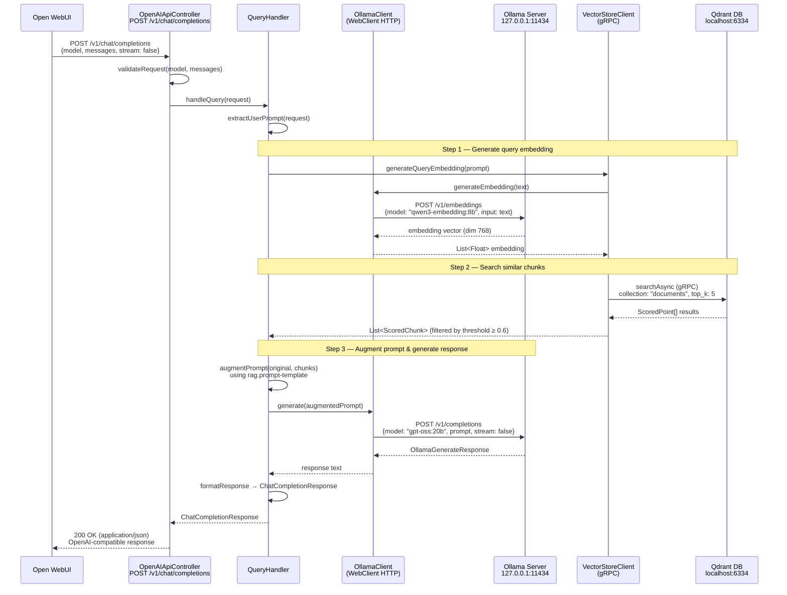
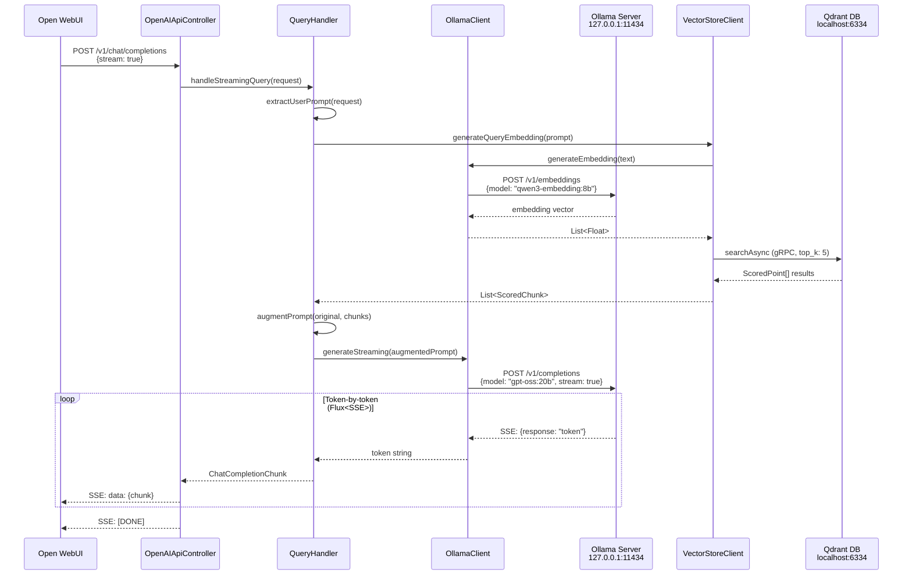
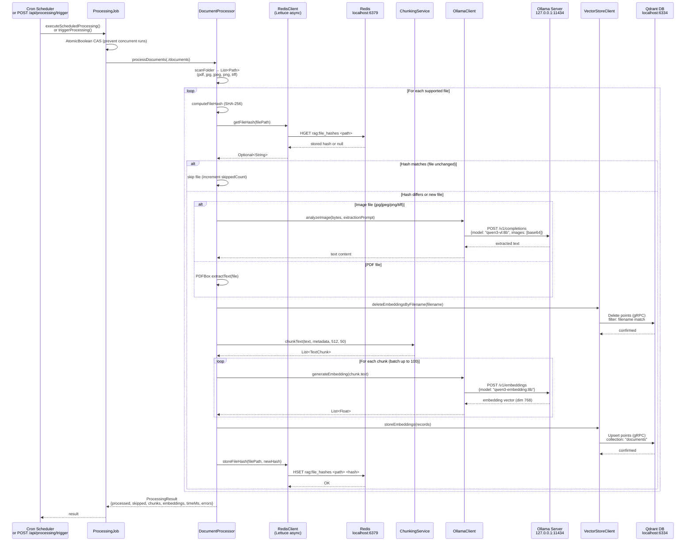
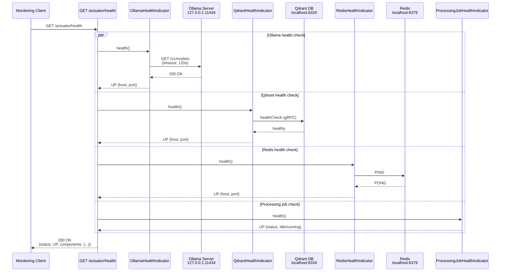
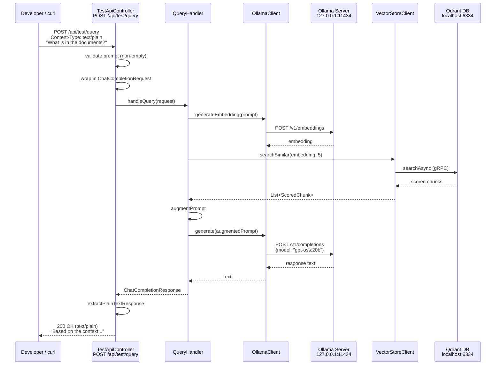

# RAG OpenAI API with Ollama

Retrieval-Augmented Generation (RAG) application that provides OpenAI-compatible API endpoints while using local Ollama LLM models. The system processes documents (PDFs and images) from a configured folder, stores them as vector embeddings in Qdrant, and augments user prompts with relevant context before generating responses.

## Table of Contents

- [Architecture Sequence Diagrams](#architecture-sequence-diagrams)
- [Prerequisites](#prerequisites)
- [Quick Start](#quick-start)
- [Building the Project](#building-the-project)
- [Configuration](#configuration)
- [Running the Application](#running-the-application)
- [Docker Deployment](#docker-deployment)
- [API Endpoints](#api-endpoints)
- [Health Checks](#health-checks)
- [Troubleshooting](#troubleshooting)
- [Technology Stack](#technology-stack)

## Architecture Sequence Diagrams

### 1. Query Flow — OpenWebUI → RAG App → Ollama & Qdrant (Non-Streaming)

Shows how an external client (e.g. Open WebUI) sends a chat completion request and receives a RAG-augmented response.



### 2. Query Flow — Streaming Mode (SSE)

Shows the streaming variant where tokens are forwarded as Server-Sent Events.



### 3. Document Processing Flow — Scheduled / On-Demand

Shows how documents (PDFs and images) are ingested, chunked, embedded, and stored.



### 4. Health Check Flow

Shows how the actuator health endpoint verifies connectivity to all external services.



### 5. Test API Flow — Simple Plain-Text Query

Shows the simplified test endpoint that wraps the same RAG pipeline.



## Prerequisites

Before running the application, ensure you have the following installed:

### Required

- **Java 25**: Download from [Oracle](https://www.oracle.com/java/technologies/downloads/) or use [SDKMAN](https://sdkman.io/)
- **Gradle 9.2**: Included via Gradle wrapper (no separate installation needed)
- **Docker & Docker Compose**: For containerized deployment ([Install Docker](https://docs.docker.com/get-docker/))
- **Ollama**: Local LLM server ([Install Ollama](https://ollama.ai/))

### Ollama Models

After installing Ollama, pull the required models:

```bash
# Text generation model
ollama pull gpt-oss:20b

# Embedding model
ollama pull qwen3-embedding:8b

# Vision model for image text extraction
ollama pull qwen3-vl:8b
```

Verify Ollama is running:
```bash
curl http://localhost:11434/api/tags
```

## Quick Start

1. Clone the repository and navigate to the project directory
2. Create a documents folder:
   ```bash
   mkdir -p documents
   ```
3. Add PDF or image files to the `documents` folder
4. Start the application using Docker Compose:
   ```bash
   docker-compose up -d
   ```
5. Access Swagger UI at http://localhost:8080/swagger-ui.html

## Building the Project

### Using Gradle Wrapper (Recommended)

The project includes Gradle wrapper scripts that automatically download and use Gradle 9.2:

```bash
# Build the project
./gradlew build

# Run all tests
./gradlew test

# Run the application locally
./gradlew bootRun

# Clean and rebuild
./gradlew clean build

# Skip tests during build
./gradlew build -x test
```

On Windows, use `gradlew.bat` instead of `./gradlew`.

### Build Output

The build produces a Spring Boot executable JAR:
```
build/libs/rag-openai-api-ollama-1.0.0.jar
```

## Configuration

All configuration is in `src/main/resources/application.yaml`. Key properties:

### Server Configuration
```yaml
server:
  port: 8080                    # Application port
  shutdown: graceful            # Graceful shutdown with 30s timeout
```

### Ollama Configuration
```yaml
ollama:
  host: 127.0.0.1                # Ollama server host
  port: 11434                    # Ollama server port
  model-name: llama3.2:3b        # Text generation model
  embedding-model-name: qwen3-embedding:8b   # multilingual Embedding model
  vision-model-name: qwen3-vl:8b # Vision model for images
  connection-timeout: 30s        # Connection timeout
  read-timeout: 120s             # Read timeout for long responses
```

### Qdrant Configuration
```yaml
qdrant:
  host: localhost               # Qdrant server host
  port: 6334                    # Qdrant gRPC port
  collection-name: documents    # Collection name for embeddings
  connection-timeout: 10s       # Connection timeout
```

### Redis Configuration
```yaml
redis:
  host: localhost               # Redis server host
  port: 6379                    # Redis server port
  connection-timeout: 5s        # Connection timeout
  database: 0                   # Redis database index
```

### Document Processing Configuration
```yaml
documents:
  input-folder: ./documents     # Folder to scan for documents
  supported-extensions:         # Supported file types
    - pdf
    - jpg
    - jpeg
    - png
    - tiff

processing:
  schedule: "0 */15 * * * *"    # Cron: every 15 minutes
  chunk-size: 512               # Text chunk size in characters
  chunk-overlap: 50             # Overlap between chunks
  batch-size: 100               # Batch size for embedding storage
  max-concurrent-files: 5       # Max parallel file processing
  job-timeout: 60s              # Processing job timeout
```

### RAG Configuration
```yaml
rag:
  top-k-results: 5              # Number of similar chunks to retrieve
  similarity-threshold: 0.7     # Minimum similarity score (0.0-1.0)
  context-separator: "\n\n---\n\n"  # Separator between chunks
  prompt-template: |            # Template for augmented prompts
    Use the following context to answer the question...
```

### OpenAI API Configuration

Controls the model metadata returned by the OpenAI-compatible `GET /v1/models` endpoint. All three properties are required at startup (`model-name` and `owned-by` must not be null).

```yaml
openai:
  api:
    model-name: local              # Model identifier returned by /v1/models
    creation-date: 1773532800      # Unix timestamp exposed as the model creation date
    owned-by: host-machine         # Owner label for the model entry
```

### Environment Variable Overrides

All configuration properties can be overridden using environment variables:

```bash
# Ollama
export OLLAMA_HOST=127.0.0.1
export OLLAMA_PORT=11434
export OLLAMA_MODEL_NAME=llama3.2:3b

# Qdrant
export QDRANT_HOST=localhost
export QDRANT_PORT=6334

# Redis
export REDIS_HOST=localhost
export REDIS_PORT=6379

# Documents
export DOCUMENTS_INPUT_FOLDER=./documents

# Processing
export PROCESSING_CHUNK_SIZE=512
export PROCESSING_CHUNK_OVERLAP=50

# RAG
export RAG_TOP_K_RESULTS=5
export RAG_SIMILARITY_THRESHOLD=0.7

# OpenAI API
export OPENAI_API_MODEL_NAME=local
export OPENAI_API_CREATION_DATE=1773532800
export OPENAI_API_OWNED_BY=host-machine
```

## Running the Application

### Local Development

1. Start required services (Qdrant and Redis):
   ```bash
   docker-compose up -d qdrant redis
   ```

2. Ensure Ollama is running on your host machine

3. Run the application:
   ```bash
   ./gradlew bootRun
   ```

4. The application will be available at http://localhost:8080

### Running the JAR

```bash
# Build the JAR
./gradlew build

# Run the JAR
java -jar build/libs/rag-openai-api-ollama-1.0.0.jar
```

## Docker Deployment

### Using Docker Compose (Recommended)

The `docker-compose.yml` orchestrates all services:

```bash
# Start all services
docker-compose up -d

# View logs
docker-compose logs -f

# View logs for specific service
docker-compose logs -f rag-app

# Stop all services
docker-compose down

# Stop and remove volumes (deletes data)
docker-compose down -v

# Rebuild and restart
docker-compose up -d --build
```

### Service Architecture

Docker Compose starts three services:

1. **qdrant**: Vector database (ports 6333, 6334)
2. **redis**: Hash store for file tracking (port 6379)
3. **rag-app**: Spring Boot application (port 8080)

### Volume Mounts

- `./documents:/app/documents` - Document folder (add your PDFs/images here)
- `./logs:/app/logs` - Application logs
- `qdrant_data` - Qdrant vector database persistence
- `redis_data` - Redis data persistence

### Network Configuration

The application accesses Ollama on the host machine using `host.docker.internal`. Ensure Ollama is running on your host before starting the containers.

### Building Docker Image Manually

```bash
# Build the image
docker build -t rag-openai-api-ollama:latest .

# Run the container
docker run -d \
  -p 8080:8080 \
  -v $(pwd)/documents:/app/documents \
  -e OLLAMA_HOST=host.docker.internal \
  -e QDRANT_HOST=qdrant \
  -e REDIS_HOST=redis \
  --name rag-app \
  rag-openai-api-ollama:latest
```

## API Endpoints

### OpenAI-Compatible Endpoints

#### POST /v1/chat/completions

OpenAI-compatible chat completion endpoint.

**Request:**
```bash
curl -X POST http://localhost:8080/v1/chat/completions \
  -H "Content-Type: application/json" \
  -d '{
    "model": "llama3.2:3b",
    "messages": [
      {"role": "user", "content": "What is in the documents?"}
    ],
    "stream": false
  }'
```

**Streaming Request:**
```bash
curl -X POST http://localhost:8080/v1/chat/completions \
  -H "Content-Type: application/json" \
  -d '{
    "model": "llama3.2:3b",
    "messages": [
      {"role": "user", "content": "Summarize the documents"}
    ],
    "stream": true
  }'
```

#### GET /v1/models
Returns a list of available models.

**Request:**
```bash
curl http://localhost:8080/v1/models
```

**Response:**
```json
{
  "object": "list",
  "data": [
    {
      "id": "local",
      "object": "model",
      "created": 1773532800,
      "owned_by": "host-machine"
    }
  ]
}
```

### Simple Test Endpoint

#### POST /api/test/query

Simple plain-text endpoint for testing RAG functionality.

**Request:**
```bash
curl -X POST http://localhost:8080/api/test/query \
  -H "Content-Type: text/plain" \
  -d "What is the main topic of the documents?"
```

**Response:**
```
Based on the provided context, the main topic is...
```

### Processing Trigger Endpoint

#### POST /api/processing/trigger

Manually trigger document processing.

**Request:**
```bash
curl -X POST http://localhost:8080/api/processing/trigger
```

**Response:**
```json
{
  "documentsProcessed": 5,
  "documentsSkipped": 2,
  "chunksCreated": 150,
  "embeddingsStored": 150,
  "processingTimeMs": 12500,
  "errors": []
}
```

### Interactive API Documentation

Access Swagger UI for interactive API testing:

**URL:** http://localhost:8080/swagger-ui.html

Features:
- Interactive request/response testing
- Complete API documentation
- Request/response examples
- Schema definitions

**OpenAPI Specification:** http://localhost:8080/api-docs

## Health Checks

### GET /actuator/health

Check application and service health.

**Request:**
```bash
curl http://localhost:8080/actuator/health
```

**Response:**
```json
{
  "status": "UP",
  "components": {
    "ollama": {
      "status": "UP",
      "details": {
        "host": "127.0.0.1",
        "port": 11434
      }
    },
    "qdrant": {
      "status": "UP",
      "details": {
        "host": "localhost",
        "port": 6334
      }
    },
    "redis": {
      "status": "UP",
      "details": {
        "host": "localhost",
        "port": 6379
      }
    },
    "processingJob": {
      "status": "UP",
      "details": {
        "lastExecution": "2024-03-15T10:30:00Z",
        "status": "idle"
      }
    }
  }
}
```

### Additional Actuator Endpoints

- **Metrics:** http://localhost:8080/actuator/metrics
- **Info:** http://localhost:8080/actuator/info

## Troubleshooting

### Application Won't Start

**Problem:** Application fails to start with connection errors.

**Solution:**
1. Verify all required services are running:
   ```bash
   # Check Ollama
   curl http://localhost:11434/api/tags
   
   # Check Qdrant
   curl http://localhost:6333/healthz
   
   # Check Redis
   redis-cli ping
   ```

2. Check Docker containers:
   ```bash
   docker-compose ps
   ```

3. View application logs:
   ```bash
   docker-compose logs rag-app
   # or
   tail -f logs/rag-application.log
   ```

### Ollama Connection Failed

**Problem:** `ServiceUnavailableException: Ollama server unreachable`

**Solution:**
1. Ensure Ollama is running:
   ```bash
   ollama list
   ```

2. If using Docker, verify `host.docker.internal` resolves:
   ```bash
   docker exec rag-app ping host.docker.internal
   ```

3. On Linux, you may need to use `--network host` or configure the host IP

### Models Not Found

**Problem:** `Model not found: gpt-oss:20b`

**Solution:**
Pull the required models:
```bash
ollama pull gpt-oss:20b
ollama pull qwen3-embedding:8b
ollama pull qwen3-vl:8b
```

### No Documents Processed

**Problem:** Processing job runs but no documents are indexed.

**Solution:**
1. Check the documents folder exists and contains supported files:
   ```bash
   ls -la documents/
   ```

2. Verify file extensions are supported (pdf, jpg, jpeg, png, tiff)

3. Check processing logs:
   ```bash
   grep "Processing" logs/rag-application.log
   ```

4. Manually trigger processing:
   ```bash
   curl -X POST http://localhost:8080/api/processing/trigger
   ```

### Qdrant Connection Issues

**Problem:** `Failed to connect to Qdrant`

**Solution:**
1. Verify Qdrant is running:
   ```bash
   docker-compose ps qdrant
   ```

2. Check Qdrant health:
   ```bash
   curl http://localhost:6333/healthz
   ```

3. Restart Qdrant:
   ```bash
   docker-compose restart qdrant
   ```

### Redis Connection Issues

**Problem:** `Failed to connect to Redis`

**Solution:**
1. Verify Redis is running:
   ```bash
   docker-compose ps redis
   ```

2. Test Redis connection:
   ```bash
   redis-cli ping
   ```

3. Restart Redis:
   ```bash
   docker-compose restart redis
   ```

### Out of Memory Errors

**Problem:** Application crashes with `OutOfMemoryError`

**Solution:**
1. Increase JVM heap size:
   ```bash
   export JAVA_OPTS="-Xmx4g -Xms2g"
   ./gradlew bootRun
   ```

2. Or in Docker, add to `docker-compose.yml`:
   ```yaml
   environment:
     - JAVA_OPTS=-Xmx4g -Xms2g
   ```

3. Reduce batch size in configuration:
   ```yaml
   processing:
     batch-size: 50
     max-concurrent-files: 2
   ```

### Slow Response Times

**Problem:** Queries take too long to respond.

**Solution:**
1. Reduce top-K results:
   ```yaml
   rag:
     top-k-results: 3
   ```

2. Increase similarity threshold to retrieve fewer chunks:
   ```yaml
   rag:
     similarity-threshold: 0.8
   ```

3. Use a faster Ollama model

4. Check Ollama performance:
   ```bash
   ollama ps
   ```

### Permission Denied Errors

**Problem:** `Permission denied` when accessing documents folder.

**Solution:**
1. Fix folder permissions:
   ```bash
   chmod -R 755 documents/
   ```

2. If using Docker, ensure the container user has access:
   ```bash
   chown -R 1000:1000 documents/
   ```

### Port Already in Use

**Problem:** `Port 8080 is already in use`

**Solution:**
1. Change the port in `application.yaml`:
   ```yaml
   server:
     port: 8081
   ```

2. Or use environment variable:
   ```bash
   export SERVER_PORT=8081
   ./gradlew bootRun
   ```

3. Find and kill the process using the port:
   ```bash
   # Linux/Mac
   lsof -ti:8080 | xargs kill -9
   
   # Windows
   netstat -ano | findstr :8080
   taskkill /PID <PID> /F
   ```

## Technology Stack

- **Java 25**: Latest Java with enhanced pattern matching and virtual threads
- **Spring Boot 4**: Modern Spring framework with improved performance
- **Gradle 9.2**: Build automation with Gradle wrapper
- **Apache PDFBox**: PDF text extraction
- **Ollama**: Local LLM inference (gpt-oss:20b, qwen3-embedding:8b, qwen3-vl:8b)
- **Qdrant**: High-performance vector database
- **Redis**: In-memory hash store for file tracking
- **Lettuce**: Async Redis client
- **WebFlux**: Reactive HTTP client for Ollama
- **SpringDoc OpenAPI**: Automatic API documentation generation
- **Docker**: Containerization and orchestration

## Project Structure

```
.
├── src/
│   ├── main/
│   │   ├── java/com/rag/openai/
│   │   │   ├── api/              # REST controllers
│   │   │   ├── service/          # Business logic
│   │   │   ├── client/           # External service clients
│   │   │   ├── domain/           # Data models and DTOs
│   │   │   ├── config/           # Configuration classes
│   │   │   ├── exception/        # Custom exceptions
│   │   │   ├── health/           # Health indicators
│   │   │   └── lifecycle/        # Startup/shutdown handlers
│   │   └── resources/
│   │       └── application.yaml  # Configuration
│   └── test/                     # Unit and integration tests
├── documents/                    # Document input folder
├── logs/                         # Application logs
├── build.gradle                  # Gradle build configuration
├── docker-compose.yml            # Docker orchestration
├── Dockerfile                    # Docker image definition
└── README.md                     # This file
```

